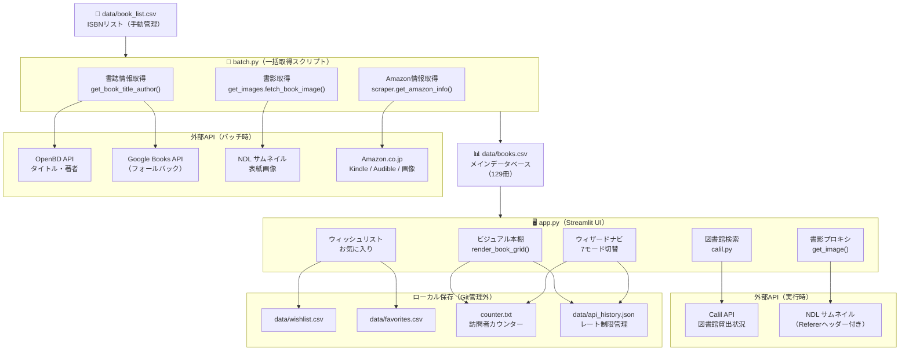

# データフロー図

## 全体構成



---

## バッチ処理フロー（batch.py）

```
book_list.csv (ISBN一覧)
    │
    ├─① OpenBD API ──────────────────► タイトル・著者
    │   └─フォールバック: Google Books
    │
    ├─② get_images.py
    │     ├─ NDL thumbnail URL ──────► 表紙画像URL (優先)
    │     └─ OpenBD / Google Books  ► 表紙画像URL (次点)
    │
    └─③ scraper.py (Amazon)
          ├─ Kindle版検索 ──────────► has_kindle, is_unlimited, is_prime_reading
          ├─ 物理本ページ ──────────► image_url (② で取れなかった場合)
          └─ Audible検索 ──────────► has_audible, is_audible

    ↓ すべてマージ

books.csv (メインDB) ← upsert（ISBN をキーに更新）
```

---

## アプリ実行時フロー（app.py）

```
起動時
  └─ books.csv を読み込み（pandas DataFrame）
        │
        ├─ ウィザードモード選択（session_state['wizard_mode']）
        │     ├─ top         : 全書籍グリッド
        │     ├─ buy         : has_kindle=True の書籍
        │     ├─ audible     : has_audible=True の書籍
        │     ├─ ebook       : is_unlimited=True / is_prime_reading=True
        │     ├─ library     : 図書館検索モード
        │     ├─ cheap       : Audible聴き放題 or KU対象
        │     └─ genre       : ジャンル別フィルタ
        │
        ├─ 書影表示 get_image(url)
        │     ├─ NDL URL → Referer付きでサーバー側取得 → バイト列
        │     └─ その他URL → st.image() に直接渡す
        │
        ├─ 図書館検索（library モード）
        │     ├─ 市区町村選択 → city_code.csv で systemid 取得
        │     └─ Calil API ポーリング → 貸出状況バッジ
        │
        └─ ウィッシュリスト / お気に入り
              ├─ wishlist.csv 読み書き（最大10冊）
              └─ favorites.csv 読み書き
```

---

## データファイル一覧

| ファイル | 更新タイミング | Git管理 |
|----------|--------------|---------|
| `data/book_list.csv` | 手動 | ✅ 管理する |
| `data/books.csv` | batch.py 実行時 | ✅ 管理する |
| `data/city_code.csv` | 変更なし（固定） | ✅ 管理する |
| `data/wishlist.csv` | アプリ使用時（ユーザー操作） | ❌ 除外 |
| `data/favorites.csv` | アプリ使用時（ユーザー操作） | ❌ 除外 |
| `data/api_history.json` | アプリ起動時（レート制限） | ❌ 除外 |
| `counter.txt` | アプリ起動時（訪問者数） | ❌ 除外 |
| `.streamlit/secrets.toml` | セットアップ時（APIキー） | ❌ 除外 |
